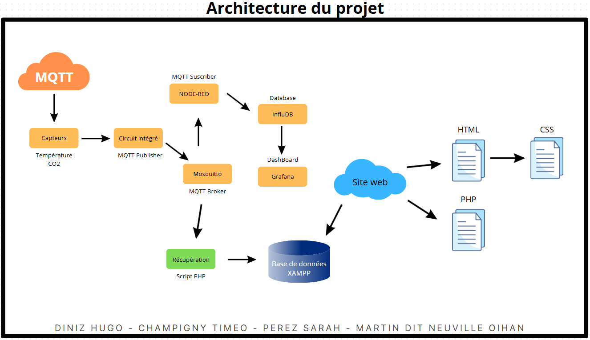

# SAé 23 – Mettre en place une solution informatique pour l’entreprise

Projet de S2 du BUT Réseaux & Télécommunications - IUT de Blagnac 

Réalisé par : **Timeo Champigny, Sarah Perez, Oihan Martin dit-Neuville, Hugo Diniz**  

À l'attention de **M. Massaoudi** 

**Année BUT1 2024-2025**


## 📌 Contexte du projet

Dans le cadre de la SAÉ 23, nous devons concevoir une solution de supervision réseau pour une infrastructure simulée.
Ce projet doit nous mettre à la place d'un professionel travaillant en R&T, chargé de développer des **outils informatiques adaptés aux besoins de l’entreprise**, intégrant **gestion de données**, **traitements automatisés** et **interface web** conviviale.
L’objectif est de centraliser les informations réseau dans une interface accessible et fonctionnelle.


## 🎯 Objectifs

- Mettre en place une chaîne de traitement via des conteneurs.
- Créer un dashboard **Grafana** complet.
- Coder un site web dynamique hébergé sur un serveur **lampp**.
- Coder un script récupérant les données sur le bus **MQTT** (langage au choix : bash, php, C, python,…).
- Créer et gérer une base de données **MySQL**.
- Automatiser la chaîne de traitement (scripts dans crontab)


## Technologies utilisées

| Composant       | Description                                  |
|------------------|---------------------------------------------|
| Lubuntu 22.04 LTS       | Système d'exploitation pour la VM           |
| Apache        | Serveur Web                                 |
| MariaDB       | Base de données relationnelle               |
| PHP           | Langage côté serveur                        |
| Node-RED      | Outil de programmation visuelle (Flow)    |
| Grafana       | Outil de visualisation de données    |
| MQTT      | Protocole basé sur publish/subscribe    |
| VMWare   | Outils de virtualisation pour la VM               |

## Architecture du projet



## ⚙Fonctionnalités principales

- Possibilité de choisir les tables que les non-admins peuvent voir
- Choix direct des salles


## Déploiement local

### Prérequis
- VMWare Workstation Pro (Recommendé) ou VMWare Player 17
- VM Lubuntu 22.40 LTS
- Serveur XAMPP (Apache, MariaDB, PHP)

### Nécessaire avant chaque utilisation

```bash
# Mettre dans crontab -e si possible
docker start influxdbRT
docker start grafanaRT
docker start noderedRT

docker exec -it influxdbRT influxdb
docker inspect influxdbRT
